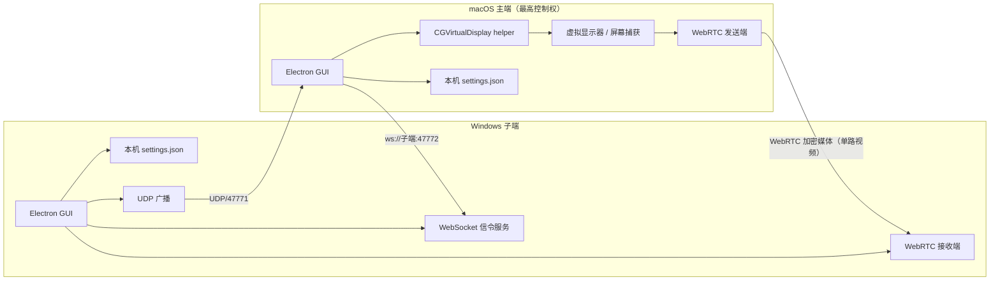

# LanExtend

LanExtend 是一个面向可信局域网的双端扩展屏 MVP：macOS 主端创建一块虚拟显示器，捕获该显示器后通过 WebRTC 将视频发送到 Windows 子端 GUI。主端发起连接并拥有会话控制权；子端负责被发现、接收信令和全屏显示。

> 当前定位是可继续开发和双机验收的工程交付，不是已签名的正式产品。仓库内的自动化测试不等于真实 Mac/Windows、不同网卡、GPU 解码或长时间运行验证。

## 支持范围

| 项目 | MVP 范围 |
| --- | --- |
| 主端 | **macOS 14 或更高版本**；Intel/Apple Silicon 需分别实机验证 |
| 子端 | **Windows 10/11 64 位** |
| 拓扑 | 一台 Mac 主端连接一台 Windows 子端；子端同时只接受一个主端会话 |
| 网络 | 同一可信 IPv4 局域网；自动 UDP 广播发现，也可填写私有 IPv4 地址 |
| 画面 | 单路视频，默认建议 1920×1080、30 FPS、8 Mbps |
| 记忆 | 本机保存分辨率、帧率、码率、最近设备、已发现/手动添加设备和子端名称/端口 |
| 当前不支持 | 音频、键鼠/触控回传、HDR、多子端、IPv6、跨公网、账号/配对/认证 |
| 分发 | 不支持 Mac App Store；CI 产物未配置 Developer ID 签名、公证或 Windows 代码签名 |

macOS 虚拟显示依赖未公开的 `CGVirtualDisplay` CoreGraphics API。它可能在系统更新后变化或失效，因此本项目把相关逻辑隔离在独立 helper 进程中，但无法消除兼容性风险。

## 已实现的 MVP

- Electron 主端/子端 GUI，平台默认角色分别为 macOS 主端和 Windows 子端。
- macOS 虚拟显示 helper 的构建、运行时 API 探测、创建和随进程释放。
- 屏幕捕获权限状态、捕获源选择和单路 WebRTC 视频发送/显示。
- Windows 子端通过 UDP 广播，Mac 主端监听并合并本机记忆列表。
- WebSocket 信令、协议版本/消息大小/字段校验、单主端占用保护。
- 主端主动连接、断开；子端可全屏并在会话期间阻止显示器休眠。
- 子端画面信息条默认隐藏，鼠标移动、触摸或键盘聚焦时短暂显示，避免遮挡扩展桌面。
- JSON 设置持久化，最多记忆 32 台设备；离线设备仍可显示和删除。
- 启动时及侧边栏手动检查 GitHub Releases；发现新版本后打开官方发布页，由用户下载并安装。
- Node 单元测试、源码语法检查，以及 macOS/Windows GitHub Actions 构建产物。

## 快速开始

### 1. 准备网络

让 Mac 与 Windows 位于同一可信 IPv4 局域网。优先按应用程序为 LanExtend 放行“专用网络”，因为 WebRTC 还会协商动态 UDP 端口。固定控制端口方向为：

- Windows 子端**出站** UDP `47771`：广播发现；Mac 主端需要能接收入站发现报文；
- Windows 子端**入站** TCP `47772`：默认 WebSocket 信令端口，可在子端 GUI 修改；
- WebRTC 动态 UDP：双向媒体/连通性检查，由系统防火墙按 LanExtend 应用放行更合适。

不要把这些端口映射到公网。当前发现和信令没有认证，信令也没有 TLS。

### 2. 先启动 Windows 子端

运行 Windows 构建产物；或在源码目录执行：

```powershell
npm ci
npm run dev:receiver
```

设置易识别的子端名称并确认监听端口。首次运行时，只允许 Windows Defender 防火墙在可信的“专用网络”放行。

### 3. 启动 macOS 主端

源码运行需要 Node.js 22+、npm 10+ 和 Xcode Command Line Tools：

```bash
npm ci
npm run build:native
npm run dev:host
```

按系统提示授予“屏幕与系统音频录制”（不同 macOS 版本名称可能略有不同）和本地网络访问权限；修改权限后完全退出并重新启动 LanExtend。

### 4. 创建并投放扩展屏

1. 从在线设备列表选择 Windows 子端；若广播被 VLAN/防火墙阻断，填写它的私有 IPv4 和端口。
2. 保持默认来源模式“创建扩展屏”，先使用逻辑分辨率 1920×1080、30 FPS、关闭 HiDPI。
3. 点击“扩展到 …”。主端先连接 WebSocket 并用 `welcome` 核对子端真实 UUID，然后自动创建虚拟显示器、定位捕获源并发起 WebRTC。
4. 连接成功后，在“系统设置 → 显示器 → 排列”中调整新增显示器方位，再把窗口拖到该显示器；Windows 子端可切换全屏。
5. 如果私有虚拟显示不可用，GUI 会切到“已有显示器”兼容模式；此时才需要手动选择捕获源。选择已有屏会发送该屏全部内容，请先清除敏感信息。
6. 使用主端“断开扩展屏”结束投放；由本会话自动创建的虚拟显示器会随断开清理。

完整操作和未签名产物说明见[用户指南](docs/user-guide.md)。公开安装包可从 [GitHub Releases](https://github.com/Modole/LanExtend/releases) 获取。

## 架构概览



发现报文只用于定位子端；远端媒体不经过云服务。WebRTC 媒体本身使用其标准加密传输，但**设备身份、发现和 WebSocket 信令均未认证**，所以必须把整个二层/三层局域网视为信任边界。

## 文档

- [用户指南](docs/user-guide.md)：macOS 主端、Windows 子端、记忆功能和日常操作。
- [架构说明](docs/architecture.md)：进程、数据流、权限模型、实现边界和演进建议。
- [协议说明](docs/protocol.md)：UDP 发现、WebSocket 信令、WebRTC 会话和版本约束。
- [安全边界](docs/security.md)：无认证 MVP、私有 API、权限、部署限制和上线前加固项。
- [开发与构建](docs/development.md)：依赖、脚本、调试、打包和 CI。
- [故障排除](docs/troubleshooting.md)：发现、端口、权限、黑屏、连接和性能问题。
- [验收清单](docs/acceptance.md)：自动化与双机手工验收，包含尚未验证项的记录方式。
- [开源方案调研](docs/open-source-research.md)：OpenDisplay、VoidDisplay、DeskPad、Deskreen、Weylus、Sunshine 等方案与许可证矩阵。
- [发布说明](docs/release.md)：GitHub Releases、CI artifacts、更新检查、签名/公证边界和正式发布门槛。
- [第三方声明](THIRD_PARTY_NOTICES.md)。

## 开源与许可证边界

LanExtend 自身代码使用 [MIT License](LICENSE)。调研中的 GPL/AGPL 项目仅作为设计先例，不是本仓库的代码依赖；不得在未完成许可证评估时复制其实现。当前直接运行时依赖为 Electron 和 `ws`，详情见[第三方声明](THIRD_PARTY_NOTICES.md)及锁定依赖文件。

## 重要限制

- 本项目不保证 macOS 私有 API 在未来系统版本继续工作。
- 当前版本没有账号、证书、配对码或设备身份校验，不适合访客 Wi-Fi、校园网、办公共享网、VPN 汇聚网或公网。
- 记忆功能只是本地便利功能，不是受信设备列表；记住一个设备不会认证它。
- CI 成功仅说明对应 runner 能完成测试和打包，不代表已完成双机视频、延迟、稳定性、签名或安全验收。
- Mac App Store 审核不接受依赖此私有 API 的实现路径；正式分发应使用 Developer ID 站外签名和公证。

## 许可证

[MIT](LICENSE) © 2026 LanExtend contributors。
