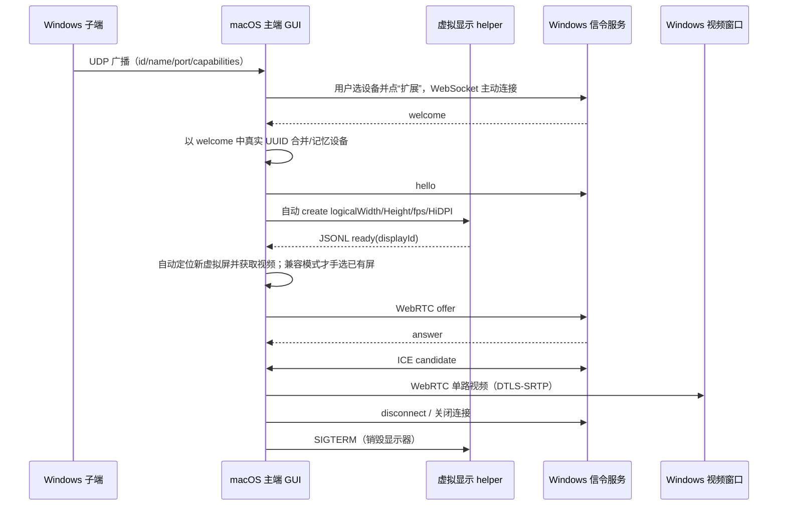
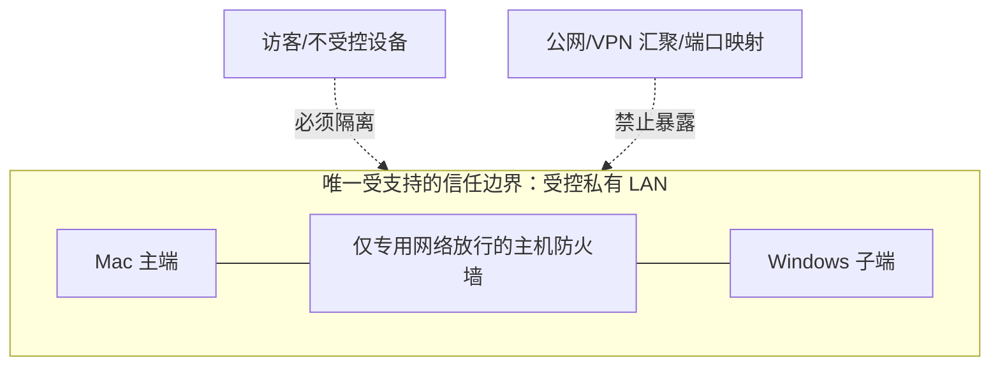

# 架构说明

## 1. 目标与非目标

LanExtend 提供两个独立目标：让 macOS 14+ 把一块“真正的扩展桌面”显示到 Windows 10/11，或在两台设备各自显示本地内容时，让 Mac 的键盘、鼠标以及文本/文件剪贴板无缝切换到 Windows。主端决定连接、布局和功能开关。

当前非目标包括音频、触控、图片/富文本剪贴板、HDR、跨公网、NAT 穿透、IPv6、多子端并发、后台服务、账号体系和企业级策略管理。

## 2. 组件与职责

| 组件 | 平台 | 职责 | 失败影响 |
| --- | --- | --- | --- |
| Electron 主进程 | 两端 | 角色选择、窗口、IPC、配置、权限、网络服务和 helper 生命周期 | 当前端整体退出 |
| 沙箱渲染进程 | 两端 | GUI、WebRTC 协商、主端捕获、子端播放和状态展示 | 当前会话中断，可重启应用 |
| preload 桥 | 两端 | 暴露白名单 IPC，隔离 Node 能力 | GUI 无法调用系统能力 |
| `lanextend-vdisplay` | macOS | 探测/调用私有 `CGVirtualDisplay` API，拥有一块虚拟显示器 | 虚拟显示器被系统移除 |
| `lanextend-input` | macOS | 监听屏幕边缘、接管全局键鼠，并读写系统文件剪贴板 | 键鼠/文件剪贴板共享停止，Mac 本地输入恢复 |
| `lanextend-input.ps1` | Windows | 常驻读取 JSONL，调用 Win32 API 注入键鼠并读写 CF_HDROP | Windows 不再接收远端输入/文件剪贴板 |
| `FileTransferManager` | 两端 | 按需启动 HTTP 文件源、流式接收、校验、取消和缓存清理 | 当前文件复制失败，不影响视频会话 |
| UDP advertiser | Windows | 每 1.5 秒广播子端元数据 | 自动发现失效，手动地址仍可用 |
| UDP listener | macOS | 监听并维护在线设备，6 秒未见即离线 | 自动发现失效 |
| WebSocket server | Windows | 接受一个主端并转发 WebRTC 信令 | 无法建会话；已有媒体也可能终止 |
| `ConfigStore` | 两端 | 原子写入设置、子端 UUID 和最多 32 个记忆设备 | 回退默认设置；不影响协议定义 |

Electron 窗口启用 `contextIsolation` 和渲染沙箱，关闭 `nodeIntegration`；渲染层不能直接访问文件系统或创建任意网络服务。外部导航被阻止，仅允许把 HTTPS 链接交给系统浏览器。

## 3. 进程和数据流



### 控制面

- Windows 子端监听 TCP，Mac 主端在用户点击“扩展”后主动发起连接，符合“主端权限最高”的产品模型。
- 主端必须先收到 `welcome` 并取得子端真实 UUID，再用该 UUID 生成稳定虚拟显示 serial、创建显示器和发起 offer；手动地址占位 ID 会在此时被真实 ID 替换。
- UDP 发现只携带定位和能力信息；收到报文时使用 UDP 数据包的来源 IPv4 作为子端地址，不信任报文自报地址。
- WebSocket 只传 `hello/offer/answer/ice/ping/pong/disconnect` 等 JSON 信令，不承载视频帧。
- 键鼠模式复用同一 WebSocket，增加 `control/input/clipboard/file-offer/file-status` 消息；它不创建 WebRTC 或虚拟显示器。文件内容不塞入 JSON，而是从当前复制端的临时 TCP 服务流式传输。
- 子端拒绝第二个同时在线的主端，返回 WebSocket 关闭码 `1013`。

### 媒体面

- 默认“创建扩展屏”模式由主端创建显示器并按返回的 display ID 自动匹配捕获源；只有私有 API 不可用或用户主动选“已有显示器”兼容模式时才手选视频源。
- 主端用 Electron 屏幕捕获接口获取自动匹配或用户选择的显示器视频流。
- 双端在渲染进程内建立 `RTCPeerConnection`，`iceServers: []`，只依赖局域网 host candidates；没有 STUN/TURN 或中继。
- 主端建立 `sendonly` 视频 transceiver，优先协商 H.264、以 VP8 为兜底；设置目标最大码率/FPS，并在 HiDPI 捕获高于逻辑目标时尝试 `scaleResolutionDownBy`。
- 媒体由 WebRTC 标准传输加密保护；这不替代设备认证，也不保护明文 WebSocket 信令免受同网攻击。
- 当前只发送视频轨道。码率和帧率是期望约束，最终编码器、解码器、实际帧率和分辨率仍由 Chromium/WebRTC、操作系统和硬件共同决定。
- 双端每秒读取一次 WebRTC stats，在 GUI 显示分辨率、FPS、估算码率和 RTT；这些是尽力而为的运行观测，不是 SLA 计量。

## 4. 虚拟显示生命周期

1. 用户选择子端并点击“扩展”；WebSocket `welcome` 返回真实子端 UUID。
2. 默认模式下，GUI 校验逻辑宽 `800–7680`、逻辑高 `600–4320`、刷新率 `15–60`，宽高必须为偶数；HiDPI 还要求 2× 物理帧缓冲不超过 `7680×7680`。
3. 主端以 `lanextend:display:<真实 UUID>` 为输入做 FNV-1a 风格 32 位非零散列，得到稳定 serial，并启动独立 helper；helper 运行时探测所需私有类和 selector。
4. helper 创建 `CGVirtualDisplayDescriptor`、mode 和 settings，等待 WindowServer 报告显示器在线。
5. helper 在标准输出发送一行 `ready` JSON，并在存活期间持有显示对象；主端轮询捕获源并按 display ID/名称自动定位它。
6. 主端断开、应用退出、helper 崩溃或系统终止显示器时，对象释放，虚拟显示器消失。

独立进程的价值是把私有 API 崩溃和生命周期从 Electron 主进程中隔离，并提供清晰的 JSONL 边界；它并不能让私有 API 获得 Apple 兼容性保证。该路径无需内核扩展，也不要求关闭 SIP 或 AMFI。

HiDPI 模式把 GUI 请求宽高视为**逻辑桌面尺寸**，物理帧缓冲宽高各为 2×。例如 1920×1080 HiDPI 对应 1920×1080 逻辑空间和 3840×2160 物理帧缓冲。像素数变为非 HiDPI 同逻辑尺寸的四倍，会显著增加 WindowServer、捕获和内存开销；发送端会尝试按所选逻辑分辨率约束/缩放 WebRTC，但最终编码尺寸必须以运行统计为准。

### 键鼠共享生命周期

1. GUI 读取 Mac 当前显示器坐标，并把 Windows 屏幕作为可拖拽矩形保存到同一逻辑坐标系。
2. 主端发出 `control/share-start`；Windows 启动常驻输入 helper 并返回主屏尺寸。
3. Mac 启动 `lanextend-input`。未跨边缘时事件原样交给 macOS，只观察鼠标位置。
4. 鼠标穿过与 Windows 矩形相邻的边缘后，helper 暂停向本机投递键鼠事件；主端把绝对鼠标位置、按键和滚轮通过 WebSocket 发送。
5. Windows helper 使用 Win32 API 执行输入。返回相邻边缘、断线或停止时会先释放全部按键。
6. `Control + Option + Command + Esc` 是本地紧急返回组合，不会发送给 Windows。

共享期间两端每 500 ms 检查纯文本剪贴板，并约每 650 ms 通过原生 helper 检查文件剪贴板。启动共享时以 Mac 当前内容为初始值，之后任一端变化都会同步；文本和文件格式互斥检测，避免把 Finder/资源管理器显示的文件名误发成文本，并用系统剪贴板 revision 抑制回环。Windows 布局使用主显示器物理像素宽高，使高 DPI 缩放下的绝对光标坐标与 Win32 一致。

文件复制端递归生成不可变清单，最多 10000 个条目、20 GiB，跳过符号链接/特殊文件；真正复制时才按需监听随机 TCP 端口。接收端按条目流式落盘到 userData 缓存，每个普通文件校验 SHA-256，并核对清单条目数、总字节和顶层名称；全部成功后才原子提交并写入系统文件剪贴板。传输可以在 GUI 取消，未完成目录立即删除，已完成缓存默认 7 天后清理。

## 5. 配置与“记忆”模型

配置位于 Electron `app.getPath('userData')/settings.json`，写入时先创建同目录临时文件再原子重命名；类 Unix 平台创建文件时请求 `0600` 权限。数据模型版本当前为 `schemaVersion: 1`。

```text
settings.json
├── host
│   ├── width / height / fps / bitrateMbps / hiDPI
│   ├── autoReconnect
│   └── lastDeviceId / lastSourceId
├── receiver
│   ├── id（首次运行生成并保持）
│   ├── name / port
│   └── autoFullscreen
├── inputSharing
│   ├── lastDeviceId / clipboard / fileClipboard / autoReconnect / edgeDelayMs
│   └── layouts[]（每个设备的 x/y/width/height）
└── rememberedDevices[最多 32]
    └── id / name / host / port / lastSeen / lastConnected
```

在线发现结果与记忆列表按设备 `id` 合并：在线项优先，离线项保留上次地址和时间。这里只保存便利信息，没有密钥、证书或信任判定；设备 UUID 和名称都可以被同网攻击者仿冒。

## 6. 权限模型

| 权限/能力 | 主端 | 子端 | 说明 |
| --- | --- | --- | --- |
| 屏幕录制 | 必需 | 不需要 | 缺失时无法可靠列出/捕获扩展屏，常见表现是黑屏 |
| 本地网络 | 必需 | Windows 防火墙放行 | 自动发现和局域网连接所需 |
| 辅助功能 | 键鼠共享必需 | 不需要 | macOS 全局事件 tap 的系统要求 |
| 麦克风/系统音频 | 不需要 | 不需要 | MVP 没有音频 |
| 管理员/root | 通常不需要 | 通常不需要 | 开放普通高位端口，不安装驱动/服务 |

## 7. 信任边界



MVP 没有认证和信令机密性，因此安全性依赖网络隔离、端点可信和操作人员正确选择设备。具体威胁与加固清单见[安全边界](security.md)。

## 8. 当前实现边界

- 仅一个虚拟显示实例和一个远端视频会话；不是多显示器编排器。
- 子端同一时刻只允许一个 WebSocket 主端会话；不是多租户服务。
- 仅私有 IPv4 手动目标；没有主机名、IPv6、mDNS、跨网段注册中心或中继。
- 文件剪贴板仅支持普通文件、目录和多选，不同步符号链接、特殊文件、Finder/NTFS 扩展属性、ACL、resource fork 或稀疏文件语义。
- 不做端到端设备身份验证；“主端最高权限”是交互和连接方向约束，不是密码学授权。
- 没有服务质量保证、动态分辨率、自适应 UI 或可观测性后端。
- CI 不运行真实 WindowServer 双机链路，也不验证 GPU 编解码、实际延迟或私有 API 的全部系统版本。

## 9. 建议演进顺序

1. 加入一次性配对码、持久设备公钥和 WSS/认证信令，默认拒绝未配对主端。
2. 对广播报文签名或只将广播视作候选，再由已配对身份确认。
3. 增加明确的会话确认弹窗、设备指纹、撤销和连接审计。
4. 增加端到端统计、崩溃恢复、编码器能力探测和分辨率/码率自适应。
5. 完成 Apple Silicon/Intel、Windows 10/11、Wi-Fi/以太网组合的长期真机矩阵。
6. 再评估音频、触控、图片/富文本剪贴板、多子端与 NAT 场景；每项都应单独设计和验收。
