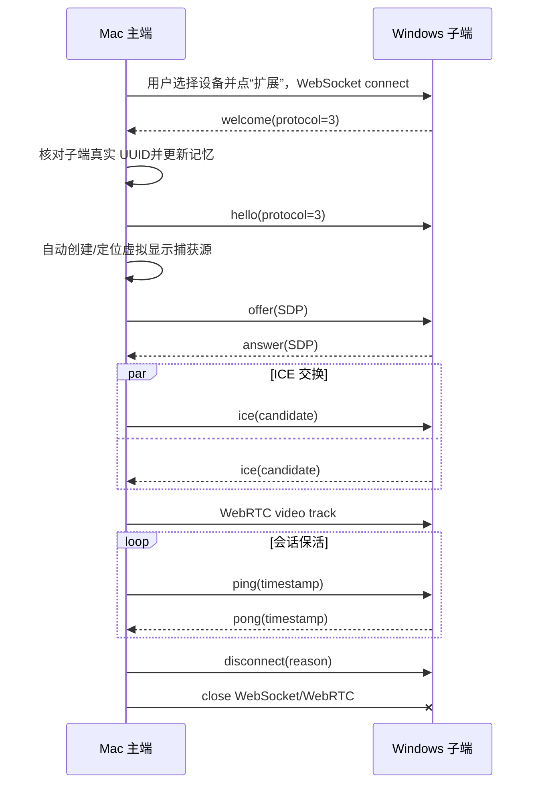

# LanExtend 协议 v3

本文描述仓库当前 `PROTOCOL_VERSION = 3` 的线协议。v3 在扩展屏、键鼠和文本剪贴板信令上加入双向文件/文件夹剪贴板，不与 v1/v2 混用。

## 1. 端口和传输

| 用途 | 方向 | 默认端口 | 传输 | 上限 |
| --- | --- | --- | --- | --- |
| 子端发现 | Windows 子端 → IPv4 广播 | UDP `47771` | 单个 UTF-8 JSON 对象 | 解析上限 4 KiB |
| WebRTC 信令及 Windows 文件源 | Mac 主端 → Windows 子端 | TCP `47772` | 明文 WebSocket `ws://`、UTF-8 JSON；按需 HTTP 文件流 | 信令单消息 256 KiB；文件 10000 条目、20 GiB |
| 视频 | Mac 主端 → Windows 子端 | 动态 | WebRTC ICE/DTLS-SRTP | 由 WebRTC 决定 |
| Mac 文件源 | Windows 子端 → Mac 主端 | 动态高位 TCP | 按需 HTTP 二进制流 | 10000 条目、20 GiB |

Windows 复制文件时，HTTP 文件流复用子端已经监听的信令 TCP 端口，避免 Windows 防火墙拦截额外随机端口；WebSocket upgrade 与 `/v1/transfers/<UUID>/stream` 在同一监听器上分流。Mac 复制文件时仍按需在 `0.0.0.0:0` 启动临时文件流服务，并在 `file-offer` 中公布实际端口。文件端点不是通用管理 API。当前没有云服务、STUN 或 TURN。信令端口可以在子端设置中修改，发现端口是固定协议常量。

## 2. 通用规则

- 除 `welcome` 外，信令消息都包含整数 `protocol: 3` 和受支持的 `type`。
- 接收方严格要求协议版本相等，不进行版本协商。
- JSON 顶层必须是普通对象，不能是数组、标量或带特殊原型的内部对象。
- 名称去除控制字符、前后空白，并截断到 64 个字符。
- 无效、超限或未知信令导致子端以 WebSocket 关闭码 `1008` 断开。
- 子端只保留一个活动 WebSocket 会话；第二个连接以 `1013`（“子端当前正在使用”）关闭。
- 正常主动断开使用 `1000`；服务停止使用 `1001`。

## 3. UDP 发现

Windows 子端启动后立即广播，之后默认每 1500 ms 向 `255.255.255.255` 及每个活动 IPv4 网卡的定向广播地址发送：

```json
{
  "type": "lanextend.receiver",
  "protocol": 3,
  "id": "5dd9a8d2-f997-4f85-b1e5-f086d1164441",
  "name": "会议室 Windows",
  "port": 47772,
  "platform": "win32",
  "capabilities": ["video", "fullscreen", "input", "clipboard", "files"],
  "display": { "width": 1920, "height": 1080, "scaleFactor": 1 }
}
```

字段约束：

| 字段 | 要求 |
| --- | --- |
| `type` | 必须等于 `lanextend.receiver` |
| `protocol` | 必须等于 `3` |
| `id` | 非空字符串，最长 128；正常实现首次运行生成 UUID 并持久化 |
| `name` | 非空字符串，最长 64 |
| `port` | 整数 `1–65535` |
| `platform` | 当前实现发送 `win32`；其他值被归一为 `unknown` |
| `capabilities` | 可选字符串数组；接收方最多保留前 8 项 |
| `display` | Windows 主显示器物理像素宽高和缩放，用于主端布局与绝对指针坐标 |

Mac 端把 UDP 数据报的来源地址作为设备 `host`，不会采用报文中自报的 IP。设备超过 6 秒未再广播即从在线列表移除，但已记忆设备仍以离线状态保留。

广播可被同网设备伪造；`id`、名称和来源 IPv4 都不是可信身份。

## 4. WebSocket 建链

主端连接 `ws://<receiver-private-ip>:<port>`。连接建立后，子端首先发送不经过通用信令解析器的欢迎消息：

```json
{
  "type": "welcome",
  "protocol": 3,
  "receiver": {
    "id": "5dd9a8d2-f997-4f85-b1e5-f086d1164441",
    "name": "会议室 Windows",
    "port": 47772,
    "capabilities": ["video", "fullscreen", "input", "clipboard", "files"],
    "display": { "width": 1920, "height": 1080, "scaleFactor": 1 }
  }
}
```

主端从 WebSocket `open` 起等待 `welcome`，当前握手超时为 10 秒。

主端先用 `welcome.receiver.id/name/port` 更新当前设备，并把手动添加时的临时 ID 替换为子端持久 UUID。默认“创建扩展屏”模式还会用这个真实 UUID 派生稳定显示 serial。然后主端发送身份介绍；这里的 `hostId` 与 `name` 只用于会话标识，不构成认证：

```json
{
  "type": "hello",
  "protocol": 3,
  "hostId": "mac-host-id",
  "name": "设计部 Mac"
}
```

`hostId` 必须是最长 256 的非空字符串，`name` 最长 64。

## 5. WebRTC 信令消息

### `offer`

由主端发送 SDP offer：

```json
{
  "type": "offer",
  "protocol": 3,
  "sdp": {
    "type": "offer",
    "sdp": "v=0\r\n..."
  }
}
```

### `answer`

由子端发送 SDP answer；结构同上，但顶层和内层 `type` 都是 `answer`。SDP 字符串最长 220000 个字符。

### `ice`

双向发送 ICE candidate：

```json
{
  "type": "ice",
  "protocol": 3,
  "candidate": {
    "candidate": "candidate:...",
    "sdpMid": "0",
    "sdpMLineIndex": 0
  }
}
```

结束候选收集可以发送 `candidate: null`。非空 candidate 必须是对象且 `candidate.candidate` 为最长 8192 的非空字符串；其他候选字段交给 WebRTC 实现处理。

### `ping` / `pong`

用于应用层存活探测，时间戳必须是非负有限数。主端默认每 5 秒发送一次：

```json
{"type":"ping","protocol":3,"timestamp":1786320000000}
```

接收 `ping` 的一端使用相同时间戳回复 `pong`，主端据此展示应用层 RTT。连续约 15 秒没有 `pong` 时，主端把会话视为失联。它不是时钟同步，也不能证明对端身份。

### `disconnect`

```json
{
  "type": "disconnect",
  "protocol": 3,
  "reason": "主端主动断开"
}
```

`reason` 可省略；存在时必须是 UTF-8 编码后不超过 120 字节的字符串。子端发出 WebSocket close frame 时还会按 UTF-8 安全边界截断到协议允许的 123 字节，不会截断多字节字符。

## 6. 键鼠与剪贴板消息

输入模式在 `hello` 后由主端发送：

```json
{
  "type": "control",
  "protocol": 3,
  "action": "share-start",
  "clipboard": true,
  "files": true,
  "screen": { "width": 1920, "height": 1080 }
}
```

子端启动 Windows 输入 helper 后回复 `share-ready`，并返回实际主屏宽高。运行期间 `active`/`inactive` 表示控制权是否已跨到 Windows；`share-stop` 结束共享，`error` 携带最长 512 字符的错误说明。

鼠标、按键和释放事件使用 `input`：

```json
{"type":"input","protocol":3,"event":{"kind":"pointer","x":960,"y":540}}
{"type":"input","protocol":3,"event":{"kind":"key","vk":65,"down":true}}
{"type":"input","protocol":3,"event":{"kind":"releaseAll"}}
```

支持的 `kind` 为 `pointer/button/wheel/key/releaseAll`。坐标是 Windows 主显示器内的逻辑像素；键盘使用 Windows virtual-key code。鼠标移动在 Mac 端合并为约 8 ms 一批，按键、点击或滚轮前会先刷新待发送位置。

纯文本剪贴板双向发送：

```json
{"type":"clipboard","protocol":3,"text":"同步文本","revision":"mac-id:12"}
```

文本 UTF-8 上限为 128 KiB；`revision` 用于观测，实际回环抑制以本地最近内容为准。图片和富文本仍不支持。

文件/文件夹剪贴板使用控制信令和独立二进制流。复制端先发送：

```json
{
  "type": "file-offer",
  "protocol": 3,
  "transfer": {
    "id": "550e8400-e29b-41d4-a716-446655440000",
    "port": 53142,
    "itemCount": 7,
    "totalBytes": 1048576,
    "names": ["设计稿", "说明.txt"],
    "expiresAt": 1786320900000,
    "warnings": []
  }
}
```

接收端只使用 WebSocket 连接所对应的私有 IPv4 作为文件源地址，不接受清单自报 host。`id` 为 UUID，`port` 为 `1–65535`；条目最多 10000、总文件内容最多 20 GiB、顶层名称最多 16 个。offer 默认 15 分钟过期，符号链接和特殊文件被跳过并可出现在 `warnings`。

接收端请求 `GET /v1/transfers/<id>/stream`。响应以 ASCII 魔数 `LEXFILE1` 开始，随后重复：4 字节大端 JSON 头长度、UTF-8 JSON 头 `{path,type,size,mtimeMs}`、文件内容（目录没有内容）、文件内容的 32 字节 SHA-256。长度为 0 的 4 字节头表示结束。路径必须是 `/` 分隔的安全相对路径；接收端拒绝路径穿越、重复路径、条目/字节/顶层名称与 offer 不一致或摘要错误。

接收进度和最终结果通过 WebSocket 返回：

```json
{"type":"file-status","protocol":3,"transferId":"550e8400-e29b-41d4-a716-446655440000","status":"receiving","bytes":524288,"totalBytes":1048576}
{"type":"file-status","protocol":3,"transferId":"550e8400-e29b-41d4-a716-446655440000","status":"completed","bytes":1048576,"totalBytes":1048576}
```

`status` 为 `receiving/completed/canceled/error`。接收端先写入 `<userData>/clipboard-files/<id>.partial`，全部校验成功后原子改名，再把顶层路径写入系统文件剪贴板；失败和取消会删除 `.partial`。已完成缓存默认保留 7 天，应用启动时清理。

## 7. 标准时序



实际 ICE 与 SDP 消息可能交错；当前双端会缓存远端描述设置前到达的候选。`RTCPeerConnection` 使用空 `iceServers`，所以只有局域网 host candidates，没有 STUN/TURN/NAT 中继。主端使用 `sendonly` 视频 transceiver，优先 H.264、以 VP8 兜底，并把设置中的码率/FPS作为 sender 上限目标；协商/编码器最终值以运行 stats 为准。offer 发出后当前最终协商超时为 20 秒。

键鼠模式用同一套 `welcome → hello → ping/pong → disconnect` 外壳，但以 `share-start/share-ready` 代替 SDP/ICE/WebRTC；它不发送视频。

自动重连属于客户端策略，不改变线协议：只有网络/异常断开才按约 1.6、3.2、6.4、12 秒退避（之后封顶 12 秒）；用户主动断开、收到显式 `disconnect`，或 WebSocket 以 `1000`/`1008` 结束时不自动重连。

## 8. 手动目标校验

主端 GUI 的手动目标只接受以下 IPv4：

- `10.0.0.0/8`
- `172.16.0.0/12`
- `192.168.0.0/16`
- `127.0.0.0/8`
- `169.254.0.0/16`

这只是减少误连公网的输入校验，不是访问控制。当前不接受 IPv6、DNS 主机名或公网 IPv4。

## 9. 安全属性

| 属性 | 当前状态 |
| --- | --- |
| 视频传输机密性/完整性 | 由 WebRTC DTLS-SRTP 提供 |
| 发现真实性 | 无 |
| 设备身份认证 | 无 |
| WebSocket 信令机密性/完整性 | 无 TLS，仅有格式校验 |
| 重放保护 | 无应用层保证 |
| 授权 | 仅“主端主动连接 + 子端单会话”的流程限制 |
| DoS 缓解 | 消息大小、字段校验和单会话限制；不构成完整防护 |

因此协议 v3 只适用于用户自己的受控局域网。文件流和 WebSocket 信令均没有 TLS/设备认证；当前产品选择不实现账号或配对，如果未来扩大到共享网络，应另行提升协议并设计设备身份和加密。

## 10. 兼容性变更规则

以下变更必须提升 `PROTOCOL_VERSION`：

- 修改既有字段含义、必填性、范围或信令方向；
- 更换媒体协商流程或安全模型；
- 增加必须被旧端理解的消息；
- 改变端口/发现模型且没有兼容回退。

仅增加可忽略的 GUI 元数据也应先确认当前解析器是否会保留；v3 解析器只验证已知关键字段，不提供通用扩展协商。
